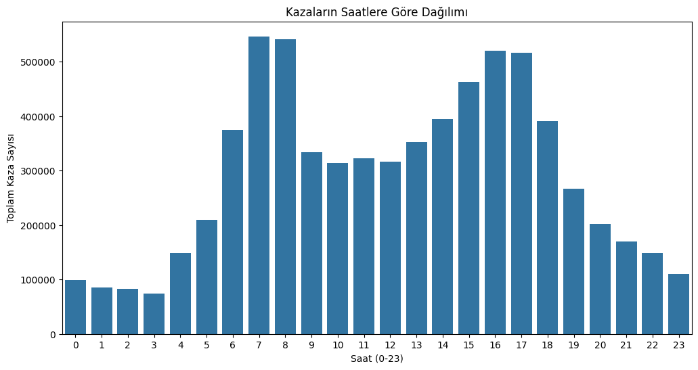
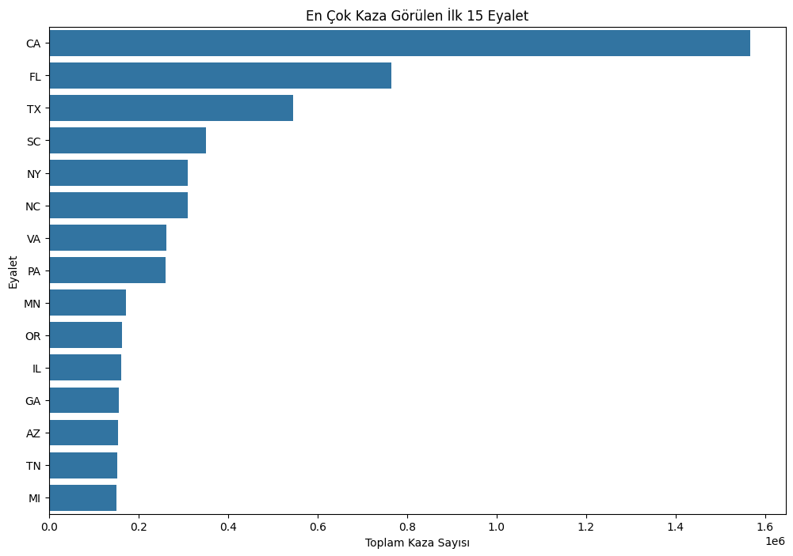
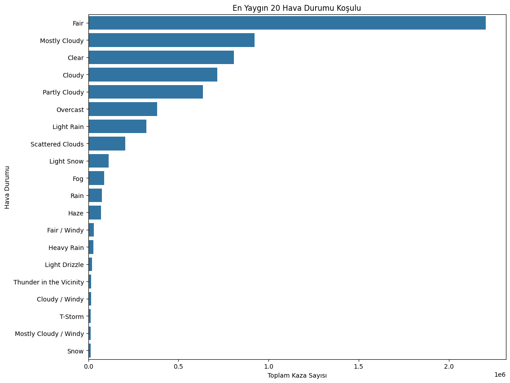
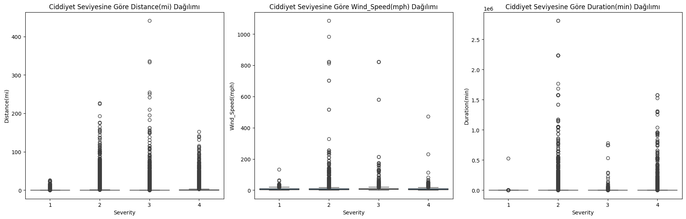
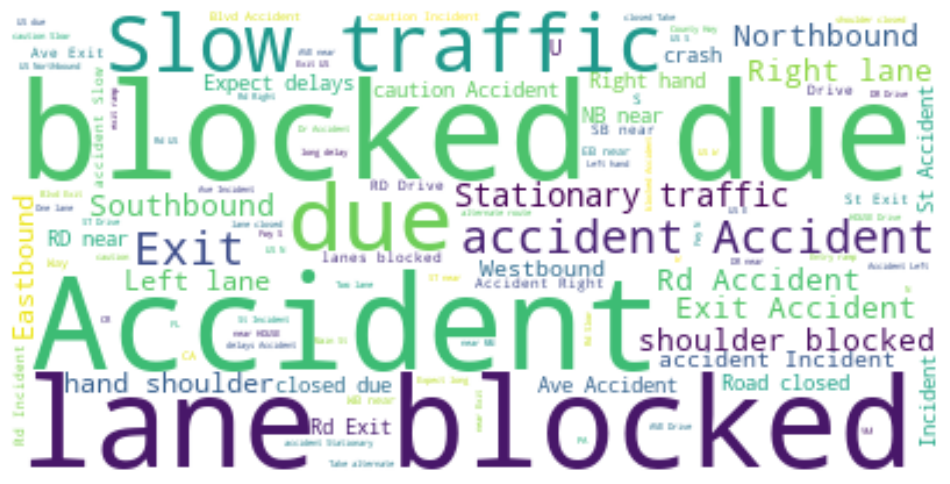
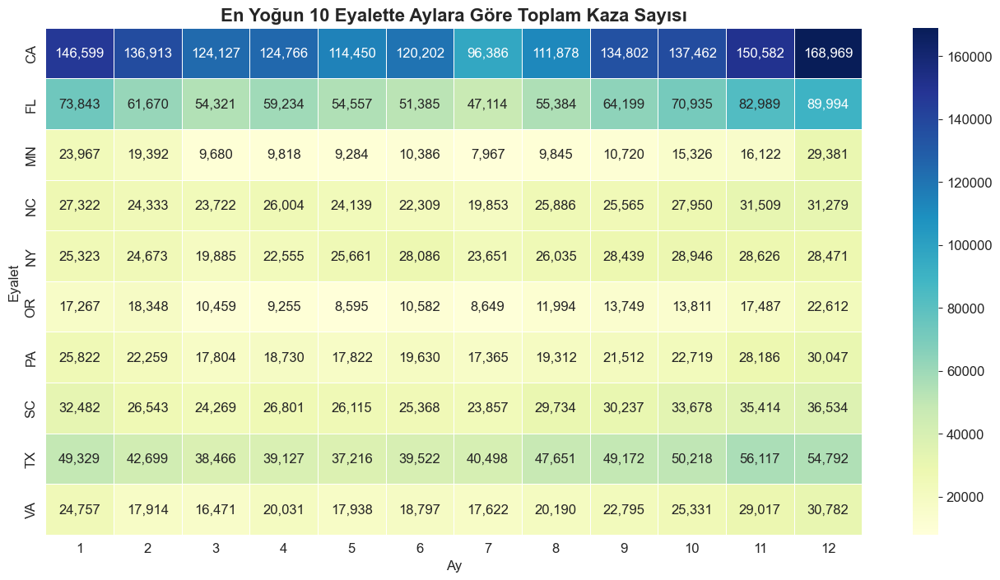
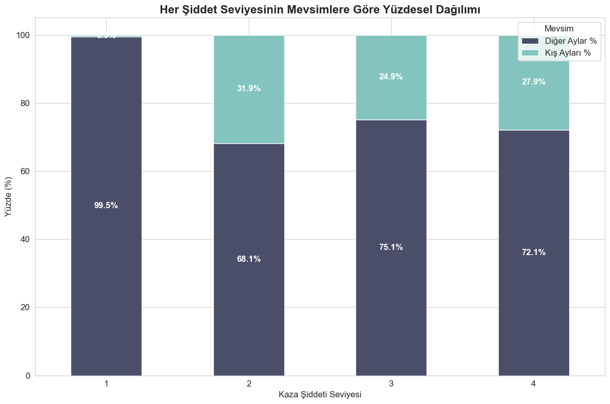
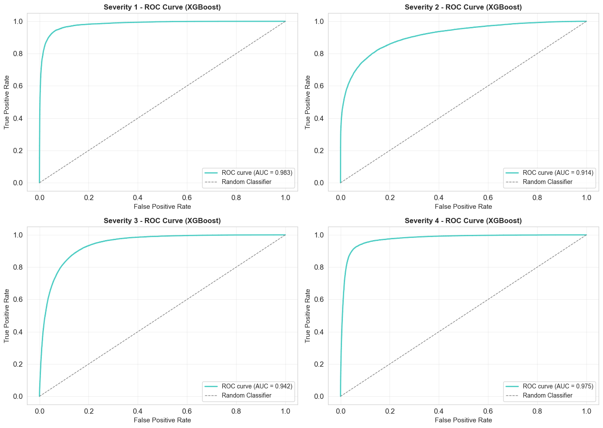
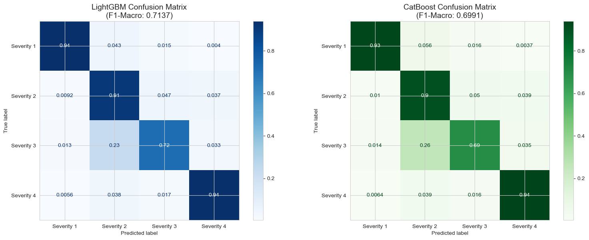
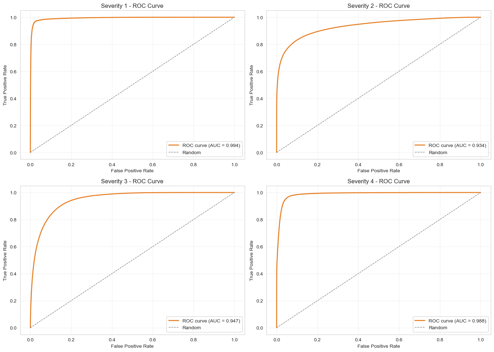

# US Accidents — Trafik Kazası Şiddet Tahmini ve Veri Madenciliği

> ABD'de 7 milyon trafik kazasından oluşan dev veri setinde **Severity (1–4)** sınıfını tahmin etmek için yapılan uçtan uca bir veri bilimi projesi. Keşifsel analiz, akıllı özellik mühendisliği, sınıf dengeleme stratejileri ve boosting tabanlı modellerin (LightGBM, CatBoost) karşılaştırmalı değerlendirmesi.

<p align="center">
  
  
  
  
  
  
</p>

<p align="center">
  <b>Final Model — LightGBM</b><br>
  <code>F1-Macro: 0.7137</code> &nbsp;•&nbsp; <code>Accuracy: 0.88</code> &nbsp;•&nbsp; <code>1.5M test örneklemi</code>
</p>

---

## Proje Özeti

Bu çalışma, ABD genelindeki trafik kazalarının **şiddet derecesini (Severity 1–4)** çevresel, zamansal, mekânsal ve yapısal faktörlere göre tahmin eden uçtan uca bir veri madenciliği projesidir.

114 hücrelik tek bir Jupyter notebook içinde:
- Kapsamlı keşifsel veri analizi (32 görsel)
- İleri düzey özellik mühendisliği (cyclical encoding, etkileşim özellikleri, metin madenciliği)
- Sınıf dengesizliği için iki aşamalı strateji (oransal undersampling + SMOTE)
- LightGBM ve CatBoost karşılaştırmalı değerlendirmesi
- ROC-AUC, Confusion Matrix ve sınıf bazlı metriklerle çok yönlü analiz

> **Amaç:** Kaza şiddetini en iyi açıklayan faktörleri tespit etmek ve azınlık sınıflarda (özellikle ölümcül kazalar — Severity 4) yüksek recall sağlayan bir model üretmek.

---

## Veri Seti

| Özellik | Değer |
|---|---|
| **Kaynak** | [Kaggle — US Accidents (Sobhan Moosavi)](https://www.kaggle.com/datasets/sobhanmoosavi/us-accidents) |
| **Boyut** | ~7.000.000 satır × 46 sütun |
| **Hedef Değişken** | `Severity` (1, 2, 3, 4) |
| **Coğrafi Kapsam** | 49 ABD eyaleti |
| **Zaman Aralığı** | Şubat 2016 — Mart 2023 |

### Severity (Şiddet) Sınıfları

| Sınıf | Anlamı | Trafik Etkisi |
|:---:|---|---|
| **1** | Hafif | Çok düşük |
| **2** | Orta | Düşük–Orta (en yaygın sınıf, ~%80) |
| **3** | Ciddi | Yüksek |
| **4** | Çok Ciddi / Ölümcül | Çok yüksek (uzun süreli yol kapanmaları) |

---

## Repo Yapısı

```
usa-acc-main/
├── AHMET_KOÇ_22040101033_TheMineStormCrew.ipynb   # Ana analiz notebook'u (114 hücre)
├── img/                                            # Notebook'tan çıkarılmış görseller
└── README.md
```

---

## Bölüm 1 — Keşifsel Veri Analizi

### Saatlik Kaza Dağılımı

<p align="center">
  
</p>

Sabah 07–09 ve akşam 15–18 saatlerinde belirgin iki zirve — klasik işe gidiş-geliş trafiğinin doğrudan yansıması. Bu örüntü `Is_Rush_Hour` özelliğinin türetilmesinin gerekçesi.

### Eyalet Bazlı Coğrafi Dağılım

<p align="center">
  
</p>

**California, Florida, Texas** kaza sayısında açık ara önde — nüfus yoğunluğu ve kara yolu ağı uzunluğunun doğal bir yansıması.

### Hava Durumu Dağılımı

<p align="center">
  
</p>

Beklenenin aksine kazaların büyük çoğunluğu **açık (Fair / Clear)** havada gerçekleşiyor — bu havalarda trafiğin daha yoğun olmasından kaynaklanan bir paradoks. Ham frekans yerine **Severity oranlarının** incelenmesi gerektiğini gösteriyor.

---

## Bölüm 2 — Akıllı Özellik Mühendisliği

Ham zaman ve konum verisi modelin daha iyi öğrenebileceği **anlamlı sinyallere** dönüştürüldü.

### Cyclical (Döngüsel) Zaman Kodlaması

24 saatlik bir döngüde "23. saat ile 0. saat" arasındaki yakınlığı modelin yakalayabilmesi için sinüs/kosinüs dönüşümü uygulandı:

```python
df['Hour_Sin']  = np.sin(2 * np.pi * raw_hour / 24)
df['Hour_Cos']  = np.cos(2 * np.pi * raw_hour / 24)
df['Month_Sin'] = np.sin(2 * np.pi * raw_month / 12)
df['Month_Cos'] = np.cos(2 * np.pi * raw_month / 12)
```

### Yol Tipi (Road_Type) — Sokak Adından Çıkarım

`Street` sütunundaki anahtar kelimeler taranarak otoyol / ana cadde ayrımı yapıldı:

```python
highway_keywords = ['Hwy', 'Fwy', 'Pkwy', 'Expy', 'Blvd',
                    'Highway', 'Freeway', 'Parkway', 'Expressway',
                    'I-', 'US-', 'SR-']
```

### Türetilmiş "Süper" Özellikler — Etkileşim Sinyalleri

Tek başına özellikler yerine **birden fazla koşulun kesişimi** çok daha güçlü sinyaller üretiyor:

| Özellik | Tanım | Hedef Sinyal |
|---|---|---|
| `Is_Rush_Hour` | Sabah 07–09 + akşam 15–18 | Yoğunluk → düşük şiddet |
| `Is_Stop_and_Go_Traffic` | Yoğun saat **VE** kontrol noktası | Şehir içi dur-kalk trafiği |
| `Is_Low_Speed_Zone_Accident` | Ara sokak **VE** dur-kalk trafiği | Hafif kaza göstergesi |
| `Is_High_Energy_Zone` | Otoyol **VE** kavşak | Ciddi kaza göstergesi |
| `Is_Night_Weekend` | Gece **VE** hafta sonu | Yüksek risk profili |
| `Was_Precipitation` | `Precipitation(in)` > 0 (NaN → 0 imputasyonu sonrası) | Yağışlı koşul göstergesi |

### Outlier Temizliği — Sayısal Verilerin Dağılımı

Sayısal değişkenler **%1 ve %99 persentilleri** arasına sıkıştırılarak uç değerler baskılandı:

<p align="center">
  
</p>

`Distance(mi)`, `Duration(min)` ve `Wind_Speed(mph)` için clipping sonrası dağılımlar — modelin az sayıdaki ekstrem değerlerden bozulmaması sağlandı.

### Metin Madenciliği — `Description` Sütunu

Kaza açıklamalarındaki anahtar kelimelerden 4 yeni boolean sinyal üretildi:

```python
FEAT_Is_Road_Closed              # 'closed', 'closure', 'alternate route'
FEAT_Is_Lane_Blocked_On_Highway  # 'lane blocked', 'shoulder blocked'
FEAT_Is_Crash                    # 'crash', 'collision', 'accident'
FEAT_Is_Slowdown                 # 'slow', 'caution', 'delays'
```

<p align="center">
  
  <br><i>Kaza açıklamalarının kelime bulutu — en sık geçen terimler</i>
</p>

> **Bulgu:** `FEAT_Is_Road_Closed = True` olduğunda **Severity 4** oranı ciddi şekilde yükseliyor — yol kapanmaları ölümcül kazaların güçlü bir göstergesi.

---

## Bölüm 3 — Tarihsel ve Mevsimsel Analiz

### Tam Veri Seti Üzerinde Tarihsel Doğrulama

Tam veri setinin (~7M satır) zaman içindeki dağılımı, severity oranlarının trendi ve veri kalitesi incelendi:

<p align="center">
  
</p>

### Mevsimsel Oransal Analiz

Kaza **sayılarının** ötesine geçilerek, her bir ciddiyet seviyesinin **mevsimler arası oransal** değişimi analiz edildi:

<p align="center">
  
</p>

> **Bulgu:** Kış mevsimi **Severity 4** oranını belirgin şekilde artırıyor — düşük görüş + kaygan zemin kombinasyonunun ölümcül etkisi.

---

## Bölüm 4 — Sınıf Dengesizliği ve Örnekleme Stratejisi

Veri setinde **Severity 2** baskın sınıf (~%80). Doğrudan eğitim yapıldığında model azınlık sınıfları (1 ve 4) tamamen göz ardı ediyor. Çözüm için **iki aşamalı** strateji uygulandı:

### Aşama 1 — Oransal Undersampling

```python
undersample_strategy = {
    1: 1_000_000,   # tüm Severity 1'leri al
    2:   400_000,   # baskın sınıfı kırp
    3:   100_000,   # alt-örnekleme
    4: 1_000_000,   # tüm Severity 4'leri al
}
# → Dengelenmiş eğitim seti: 717.661 satır
```

### Aşama 2 — SMOTE (Azınlık Takviyesi)

Severity 1 (kodlanmış sınıf 0) eğitim setinde **53.893 → 80.000**'e çıkarıldı.

<p align="center">
  
</p>

> **Sonuç:** Bu strateji sayesinde Severity 1 ve 4 sınıflarında **%94 recall** elde edildi — modelin ölümcül kazaları kaçırma oranı çok düşük.

---

## Bölüm 5 — Tam Pipeline

```
┌──────────────────┐    ┌──────────────────┐    ┌──────────────────┐
│  Raw CSV (~7M)   │ →  │  Stratified      │ →  │  Oransal         │
│  46 sütun        │    │  Train/Test      │    │  Undersampling   │
└──────────────────┘    │  (sınıf koruma)  │    └────────┬─────────┘
                        └──────────────────┘             │
                                                         ▼
┌──────────────────┐    ┌──────────────────┐    ┌──────────────────┐
│  SMOTE (azınlık  │ ←  │  StandardScaler  │ ←  │  Feature         │
│  takviyesi)      │    │  + One-Hot       │    │  Engineering     │
└────────┬─────────┘    └──────────────────┘    │  • Cyclical Time │
         │                                      │  • Road_Type     │
         ▼                                      │  • Description   │
┌──────────────────┐                            │  • Interactions  │
│  Outlier Clip    │                            │  • Was_Precip.   │
│  (1% – 99%)      │                            └──────────────────┘
└────────┬─────────┘
         ▼
┌──────────────────────────────────────────────┐
│   Model Training: LightGBM  +  CatBoost      │
└────────┬─────────────────────────────────────┘
         ▼
┌──────────────────┐
│  Evaluation:     │
│  • F1-Macro      │
│  • Confusion Mat │
│  • ROC-AUC (OvR) │
└──────────────────┘
```

---

## Bölüm 6 — Final Model Karşılaştırması

İki gradient boosting modeli aynı dengelenmiş eğitim seti üzerinde karşılaştırıldı.

### LightGBM Konfigürasyonu

```python
lgb.LGBMClassifier(
    n_estimators = 1000,
    learning_rate = 0.05,
    num_leaves = 40,
    reg_lambda = 10,
    objective = 'multiclass',
    num_class = 4,
)
```

### CatBoost Konfigürasyonu

```python
CatBoostClassifier(
    iterations = 1000,
    learning_rate = 0.05,
    depth = 10,
    loss_function = 'MultiClass',
    l2_leaf_reg = 5,
)
```

### Sonuçlar

| Model | F1-Macro | Accuracy | Eğitim Süresi |
|---|:---:|:---:|:---:|
| **LightGBM** | **0.7137** | **0.88** | **72 sn** |
| CatBoost | 0.6991 | 0.87 | 1661 sn |

> **Sonuç:** LightGBM hem **daha yüksek F1** hem de **23× daha hızlı** eğitim ile bu pipeline'ın açık kazananı.

### Sınıf Bazlı LightGBM Raporu

| Sınıf | Precision | Recall | F1-Score | Support |
|---|:---:|:---:|:---:|:---:|
| Severity 1 | 0.46 | 0.94 | 0.61 | 13.473 |
| Severity 2 | 0.95 | 0.91 | 0.93 | 1.231.396 |
| Severity 3 | 0.76 | 0.72 | 0.74 | 259.868 |
| Severity 4 | 0.41 | 0.94 | 0.57 | 40.942 |
| **macro avg** | **0.64** | **0.88** | **0.71** | **1.545.679** |

> Azınlık sınıflarında (Sev 1 ve Sev 4) **%94 recall** elde edilmesi özellikle önemli — modelin "ölümcül kazaları" kaçırma oranı çok düşük, ki gerçek dünyada en kritik metrik bu.

### Confusion Matrix — LightGBM vs CatBoost

<p align="center">
  
</p>

### ROC-AUC (One-vs-Rest) — CatBoost

<p align="center">
  
</p>

Her bir Severity sınıfı için ayrı ROC eğrileri — modelin hangi sınıfta daha güçlü ayırt edicilik gösterdiğini ortaya koyuyor.

---

## Genel Bulgular

- **Boosting tabanlı modeller** (LightGBM, CatBoost) klasik yöntemlere belirgin üstünlük sağlıyor. **LightGBM**, hem hız hem doğruluk açısından bu pipeline'ın açık kazananı.

- **Sınıf dengeleme kritik** — Doğrudan eğitim azınlık sınıflarını (1 ve 4) tamamen göz ardı ediyor. Undersampling + SMOTE kombinasyonu bu sınıflarda **%94 recall**'a ulaşmayı mümkün kılıyor.

- **Etkileşim özellikleri tek başına özelliklerden daha güçlü** — `Is_Night_Weekend`, `Is_Stop_and_Go_Traffic`, `Is_High_Energy_Zone` gibi kompozit sinyaller modelin ayırt edicilik gücünü ciddi şekilde artırıyor.

- **Metin verileri yardımcı ama önemli** — `Description` sütunundan çekilen `FEAT_Is_Road_Closed` özellikle Severity 4'ün güçlü bir göstergesi.

- **Cyclical encoding** zaman değişkenleri için linear/distance tabanlı modellerde belirgin fark yaratıyor.

- **Distance ve Visibility** yüksek şiddetli kazaların en güçlü iki sayısal belirleyicisi.

---

## Kurulum ve Çalıştırma

### 1. Veri Setini İndirin

```bash
# Kaggle CLI ile
kaggle datasets download -d sobhanmoosavi/us-accidents
unzip us-accidents.zip
mv US_Accidents_*.csv usa_acc.csv
```

> Notebook `usa_acc.csv` dosya adını arar — indirdikten sonra dosyayı bu isimle yeniden adlandırın.

### 2. Bağımlılıkları Yükleyin

```bash
pip install -r requirements.txt
```

### 3. Notebook'u Açın

```bash
jupyter notebook AHMET_KOÇ_22040101033_TheMineStormCrew.ipynb
```

> **Donanım Notu:** Tam veri seti (~3 GB CSV, ~7M satır) ile çalışmak için en az **16 GB RAM** önerilir. CatBoost eğitimi referans donanımda **~28 dk** sürmektedir.

---

## Kullanılan Teknolojiler

| Kategori | Kütüphaneler |
|---|---|
| **Veri İşleme** | `pandas`, `numpy` |
| **Görselleştirme** | `matplotlib`, `seaborn`, `wordcloud` |
| **Klasik ML** | `scikit-learn` (StandardScaler, OneHotEncoder, LogisticRegression, train_test_split) |
| **Boosting** | `lightgbm`, `catboost`, `xgboost` |
| **Sınıf Dengeleme** | `imbalanced-learn` (SMOTE) |
| **Notebook** | `jupyter` |

---

## Geliştirici

**Ahmet Koç**
ahmetkoc.iletisim@gmail.com
22040101033

---

## Atıf

Veri seti orijinal kaynağı:

> Moosavi, Sobhan, Mohammad Hossein Samavatian, Srinivasan Parthasarathy, and Rajiv Ramnath.
> *"A Countrywide Traffic Accident Dataset."*, 2019.

---

## Lisans

Bu proje akademik amaçlarla geliştirilmiştir. Veri seti Kaggle lisans koşullarına tabidir.
